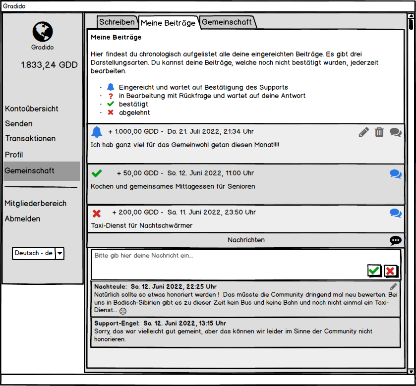

# Contribution Messaging

Die Idee des *Contribution Messagings* besteht darin, dass ein User an eine existierende Contribution eine von ihm erfasste Nachricht anhängen kann. Als Ursprungsmotivation dieses *Contribution Messagings* ist eigentlich die Kommunikation zwischen dem Support-Mitarbeiter und dem Ersteller der Contribution gedacht. Doch es sind auch Nachrichten anderer User in dieser Kommunikationkette denkbar, um beispielsweise Bemerkungen, Kritik und Anregungen zu erstellten Contributions zu hinterlassen. Dadurch soll das Miteinander innerhalb einer Community für die geleisteten Gemeinwohl-Aktivitäten in den Vordergrund gerückt werden. 

## Allgemeine Anforderungen

* Die Nachrichten zu einer Contribution werden als Detail-Ansicht der Contribution zeitlich absteigend sortiert als Liste angezeigt, das heißt die neuste Nachricht steht oben.
* Jeder beliebige User kann zu einer Contribution, egal in welchem Status diese sich befindet, eine Nachricht erstellen.
* In den Anzeigen der Contribution-Listen "Meine Beiträge" und "Gemeinschaft" kann jede enthaltene Contribution analog der Detail-Ansicht einer Transaktion aufgeklappt werden, um die schon angehängten Nachrichten anzuzeigen.
* Mit der Detail-Ansicht einer Contribution wird auch ein Button eingeblendet über den die Erfassung einer neuen Nachricht gestartet wird.
* Mit der Anzeige einer Nachricht wird auch der Ersteller und der Erstellungszeitpunkt dieser Nachricht angezeigt.
* Analog zur Detailansicht einer Contribution in der Wallet wird auch eine Detailansicht der Contributions im Admin-Bereich eingebaut.
* Die Länge einer Nachricht wird auf maximal 2000 Zeichen begrenzt
* Die Nachrichten werden als einfach verkettete Liste an die Contribution angehängt. Es wird keine Untertützung von Nachrichten an Nachrichten geben

## Contribution Detail-Ansichten

Die Contributions werden in den User-Ansichten "Meine Beiträge" und "Gemeinschaft", sowie im Admin-Interface als Listen angezeigt. Das nachfolgende Bild zeigt beispielhaft eine Contribution-List in der "Meine Beiträge"-Ansicht.

Die Liste der Contributions enthält drei Contributions, je eine in den drei verschiedenen Darstellungsarten "eingereicht", "bestätigt" und "abgelehnt". Die erste Contribution im Status "eingereicht" kann nachträglich noch bearbeitet oder gar gelöscht werden - zu erkennen an den Icons "Stift" und "Mülleimer".

Diese Möglichkeit besteht bei den beiden anderen Contributions nicht mehr, da diese schon vom Support entsprechend bestätigt oder gar abgelehnt wurden. Dafür ist bei diesen beiden Contributions an dem Sprechblasen-Icon zu erkennen, dass es zu dieser Contribution mindestens eine weitere Nachricht gibt. Mit klicken auf dieses Icon kann die Nachrichten-Ansicht der Contribution geöffnet, wie im nachfolgenden Bild dargestellt und auch wieder geschlossen werden.

Mit geöffneter Nachrichten-Ansicht wird unterhalb der Contribution eine Kopfzeile "Nachrichten" und darunter die Liste der Nachrichten angezeigt. Pro Nachricht ist der Absender, der Zeitstempel der Nachrichtenerstellung und der Nachrichtentext zu sehen. Eine einmal erstellte Nachricht kann weder bearbeitet noch gelöscht werden.

Man kann aber mit Klicken auf den Button rechts in der Nachrichten-Kopfzeile eine neue Nachricht erstellen, siehe dazu nächstes Bild.

Es wird mit KLicken auf das Sprechblasen-Icon mit den Punkten ein neues Nachrichten-Fenster direkt unterhalb der Nachrichten-Kopfzeile eingeblendet. Das Textfeld ist leer und enthält lediglich den eingeblendeten Hinweis-Text, der mit Beginn der Texteingabe sofort verschwindet. Über die beiden Buttons rechts unten im Nachrichten-Eingabefenster kann die eingegebene Nachricht gespeichert oder verworfen werden. Sobald die neue Nachricht gespeichert wurde, erscheint diese analog den schon vorhandenen Nachrichten mit dem gleichen Erscheinungsbild und ohne Speicher- oder Verwerfen-Button. Der User kann beliebig viele Nachrichten eingeben, es gibt hierzu keine Begrenzung bzw. Validierung.
