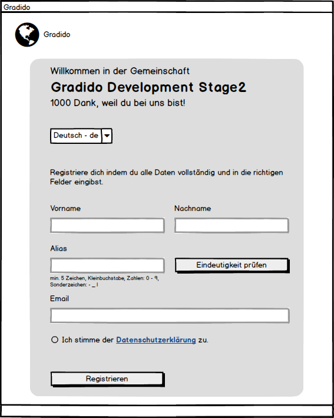

# User Alias

Mit dem *Alias* für ein User wird zusätzlich ein eindeutiger menschenlesbarer Identifier neben der GradidoID als technischer Identifier eingeführt. Mit beiden Identifiern kann ein User eindeutig identifziert werden und beide können als Key nach aussen gegeben bzw. für Schnittstellen als Eingabe-Parameter in die Anwendung verwendet werden.

Ziel dieser beiden Identifier ist von dem bisherig verwendeten Email-Identifier wegzukommen. Denn eine Email-Adresse hat für einen User einen anderen schützenswerten Privatsphären-Level als ein *Alias* oder die *GradidoID*, die beide rein auf die Gradido-Anwendung begrenzt sind. Über Email-Adressen wird gerne eine Social Engineering betrieben, um über einen User ein Profil aus den Social-Media-Netzwerken zu erstellen. Dies gilt es so weit wie möglich zu verhindern bzw. Gradido aus diesem Kreis der möglichen Datenquellen für Ausspähungen von Privatdaten herauszuhalten.

## Identifizierung eines Users

In der Gradido-Anwendung muss ein User eindeutig identifzierbar sein. Zur Identifikation eines Users gibt es unterschiedliche Anforderungen:

* eindeutiger Schlüsselwert für einen User
* leicht für den Anwender zu merken
* einfache maschinelle Verarbeitung im System
* leichte Weitergabe des Schlüsselwertes ausserhalb des Systems
* u.a.

### Schlüsselwerte

Die hier aufgeführten Schlüsselwerte dienen in der Gradido-Anwendung zur eindeutigen Identifzierung eines Users:

#### UserID

Dies ist ein rein technischer Key und wird nur **innerhalb** der Anwendung zur Identifikation eines Users verwendet. Dieser Key wird niemals nach aussen gereicht und auch niemals zwischen mehreren Communities als Schlüsselwert eingesetzt oder ausgetauscht. Die UserID wird innerhalb des Systems bei der Registrierung mit dem Speichern eines neuen Users in der Datenbank erzeugt. Die Eindeutigkeit der UserID ist damit nur innerhalb dieser einen Datenbank der Gradido-Community sichergestellt.

#### GradidoID

Die GradidoID ist zwar auch ein rein technischer Key, doch wird dieser als eine UUID der Version 4 erstellt. Dies basiert auf einer (pseudo)zufällig generierten Zahl aus 16 Bytes mit einer theoretischen Konfliktfreiheit von  in hexadezimaler Notation nach einem Pattern von fünf Gruppen durch Bindestrich getrennt - z.B. `550e8400-e29b-41d4-a716-446655440000`

Somit kann die GradidoID auch System übergreifend zwischen Communities ausgetauscht werden und bietet dennoch eine weitestgehende eindeutige theoretisch konfliktfreie Identifikation des Users. System intern ist die Eindeutigkeit bei der Erstellung eines neuen Users auf jedenfall sichergestellt.

#### Alias

Der Alias eines Users ist als rein fachlicher Key ausgelegt, der frei vom User definiert werden kann. Bei der Definition dieses frei definierbaren und menschenlesbaren Schlüsselwertes stellt die Gradido-Anwendung sicher, dass der vom User eingegebene Wert nicht schon von einem anderen User dieser Community verwendet wird. Für die Anlage eines Alias gelten folgende Konventionen:

- mindestens 5 Zeichen
  * alphanumerisch
  * keine Umlaute
  * nach folgender Regel erlaubt (RegEx: [a-z0-9]-|_[a-z0-9])
- Blacklist für Schlüsselworte, die frei definiert werden können
- vordefinierte/reservierte System relevante Namen dürfen maximal aus 4 Zeichen bestehen

#### Email

Die Email eines Users als fachlicher Key bleibt zwar weiterhin bestehen, doch wird diese schrittweise durch die GradidoID und den Alias in den verschiedenen Anwendungsfällen des Gradido-Systems ersetzt. Das bedeutet zum Beispiel, dass die bisherige Verwendung der Email für die Registrierung bzw. den Login entfällt und durch die GradidoID bzw. den Alias erfolgen wird.

Die Email wird weiterhin für einen Kommunikationskanal ausserhalb der Gradido-Anwendung mit dem User benötigt. Es soll aber zukünftig möglich sein, dass ein User ggf. mehrere Email-Adressen für unterschiedliche fachliche Kommunikationskanäle angeben kann.

## Erfassung des Alias

Die Erfassung des Alias erfolgt als zusätzliche Eingabe direkt bei der Registrierung eines neuen Users oder als weiterer Schritt direkt nach dem Login per Email.

### Registrierung

In der Eingabemaske der Registrierung wird nun zusätzlich das Feld *Alias* angezeigt, das der User als Pflichtfeld ausfüllen muss. 

Mit dem Button "Eindeutigkeit prüfen" wird dem User die Möglichkeit gegeben vorab die Eindeutigkeit seiner *Alias*-Eingabe zu verifizieren, bevor der Dialog über den Registrierungs-Button geschlossen wird. Denn es muss sichergestellt sein, dass noch kein existierender User der Community genau diesen *Alias* evtl. schon verwendet.

Wird diese Prüfung vom User nicht ausgeführt bevor er den Dialog mit dem Registrierungs-Button abschließt, so erfolgt diese Eindeutigkeitsprüfung als erster Schritt bevor die Eingaben als neuer User angelegt werden. 

Wird bei der Eindeutigkeitsprüfung des *Alias* festgestellt, dass es schon einen exitierenden User mit dem gleichen *Alias* gibt, dann wird wieder zurück in den Registrierungsdialog gesprungen, damit der User seine *Alias*-Eingabe korrigieren kann. Das *Alias*-Feld wird als fehlerhaft optisch markiert und mit einer aussagekräftigen Fehlermeldung dem User den *Alias*-Konflikt mitgeteilt. Dabei bleiben alle vorher eingegebenen Daten in den Eingabefeldern erhalten und es muss nur der *Alias* geändert werden.

Wurde vom User nun eine konfliktfreie Alias-Eingabe und alle Angaben der Registrierung ordnungsgemäß ausgefüllt, so kann der Registrierungsprozess wie bisher ausgeführt werden. Einziger Unterschied ist der zusätzliche Alias-Parameter, der nun an das Backend zur Erzeugung der User übergeben und dann in der Users-Tabelle gespeichert wird.
