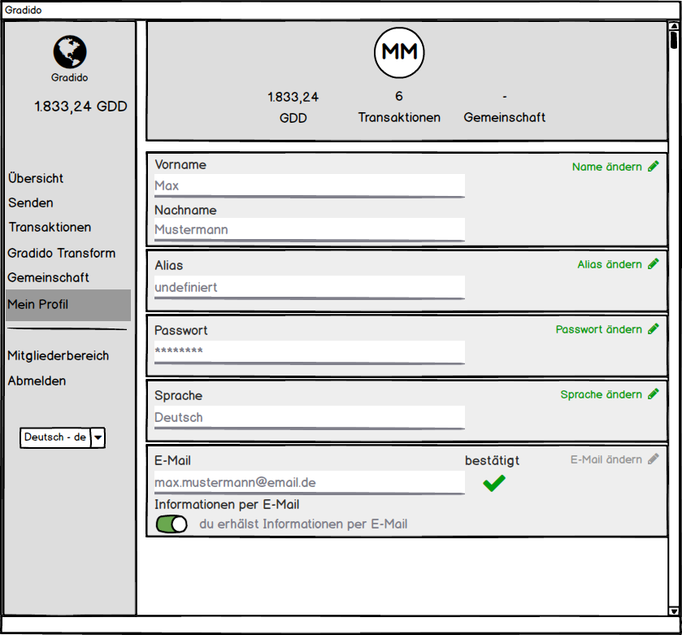
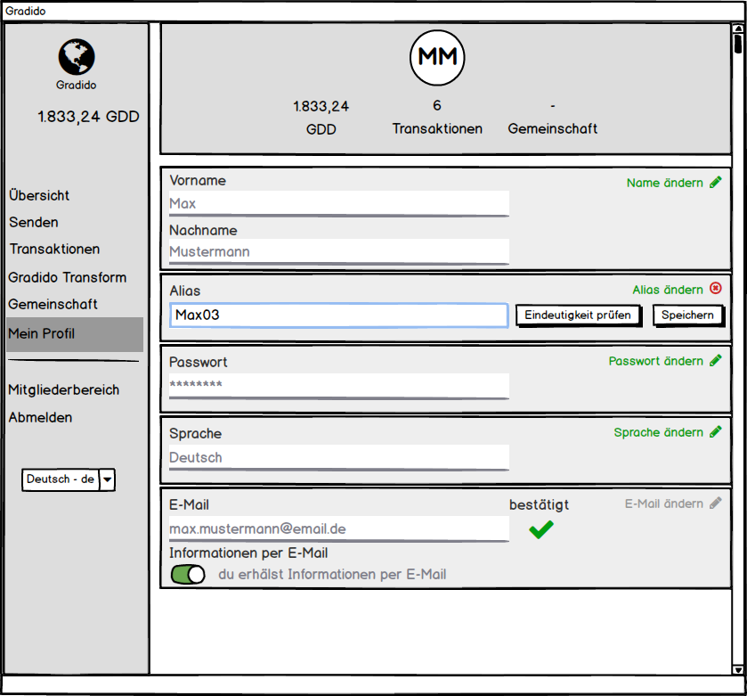
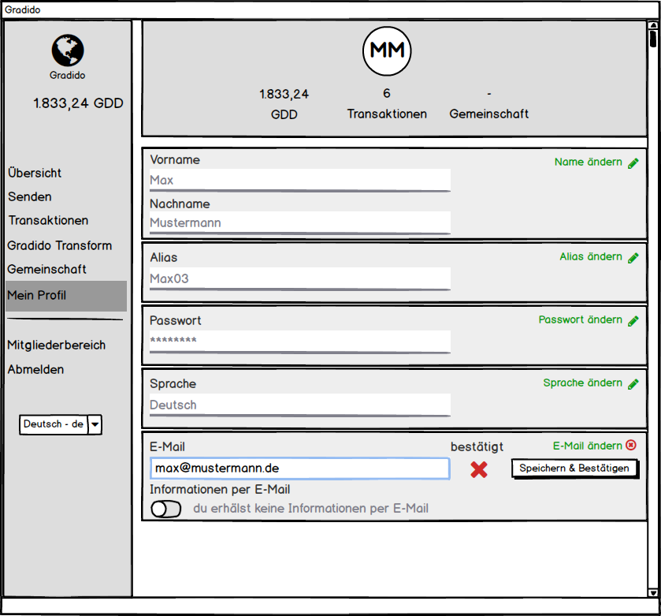

# User Alias

Mit dem *Alias* für ein User wird zusätzlich ein eindeutiger menschenlesbarer Identifier neben der GradidoID als technischer Identifier eingeführt. Mit beiden Identifiern kann ein User eindeutig identifziert werden und beide können als Key nach aussen gegeben bzw. für Schnittstellen als Eingabe-Parameter in die Anwendung verwendet werden.

Ziel dieser beiden Identifier ist von dem bisherig verwendeten Email-Identifier wegzukommen. Denn eine Email-Adresse hat für einen User einen anderen schützenswerten Privatsphären-Level als ein *Alias* oder die *GradidoID*, die beide rein auf die Gradido-Anwendung begrenzt sind. Über Email-Adressen wird gerne eine Social Engineering betrieben, um über einen User ein Profil aus den Social-Media-Netzwerken zu erstellen. Dies gilt es so weit wie möglich zu verhindern bzw. Gradido aus diesem Kreis der möglichen Datenquellen für Ausspähungen von Privatdaten herauszuhalten.

## Identifizierung eines Users

In der Gradido-Anwendung muss ein User eindeutig identifzierbar sein. Zur Identifikation eines Users gibt es unterschiedliche Anforderungen:

* eindeutiger Schlüsselwert für einen User
* leicht für den Anwender zu merken
* einfache maschinelle Verarbeitung im System
* leichte Weitergabe des Schlüsselwertes ausserhalb des Systems
* u.a.

### Schlüsselwerte

Die hier aufgeführten Schlüsselwerte dienen in der Gradido-Anwendung zur eindeutigen Identifzierung eines Users:

#### UserID

Dies ist ein rein technischer Key und wird nur **innerhalb** der Anwendung zur Identifikation eines Users verwendet. Dieser Key wird niemals nach aussen gereicht und auch niemals zwischen mehreren Communities als Schlüsselwert eingesetzt oder ausgetauscht. Die UserID wird innerhalb des Systems bei der Registrierung mit dem Speichern eines neuen Users in der Datenbank erzeugt. Die Eindeutigkeit der UserID ist damit nur innerhalb dieser einen Datenbank der Gradido-Community sichergestellt.

#### GradidoID

Die GradidoID ist zwar auch ein rein technischer Key, doch wird dieser als eine UUID der Version 4 erstellt. Dies basiert auf einer (pseudo)zufällig generierten Zahl aus 16 Bytes mit einer theoretischen Konfliktfreiheit von  in hexadezimaler Notation nach einem Pattern von fünf Gruppen durch Bindestrich getrennt - z.B. `550e8400-e29b-41d4-a716-446655440000`

Somit kann die GradidoID auch System übergreifend zwischen Communities ausgetauscht werden und bietet dennoch eine weitestgehende eindeutige theoretisch konfliktfreie Identifikation des Users. System intern ist die Eindeutigkeit bei der Erstellung eines neuen Users auf jedenfall sichergestellt.

#### Alias

Der Alias eines Users ist als rein fachlicher Key ausgelegt, der frei vom User definiert werden kann. Bei der Definition dieses frei definierbaren und menschenlesbaren Schlüsselwertes stellt die Gradido-Anwendung sicher, dass der vom User eingegebene Wert nicht schon von einem anderen User dieser Community verwendet wird. Für die Anlage eines Alias gelten folgende Konventionen:

- mindestens 5 Zeichen
  * alphanumerisch
  * keine Umlaute
  * nach folgender Regel erlaubt (RegEx: [a-zA-Z0-9]-|_[a-zA-Z0-9])
- Blacklist für Schlüsselworte, die frei definiert werden können
- vordefinierte/reservierte System relevante Namen dürfen maximal aus 4 Zeichen bestehen

#### Email

Die Email eines Users als fachlicher Key bleibt zwar weiterhin bestehen, doch wird diese schrittweise durch die GradidoID und den Alias in den verschiedenen Anwendungsfällen des Gradido-Systems ersetzt. Das bedeutet zum Beispiel, dass die bisherige Verwendung der Email für die Registrierung bzw. den Login entfällt und durch die GradidoID bzw. den Alias erfolgen wird.

Die Email wird weiterhin für einen Kommunikationskanal ausserhalb der Gradido-Anwendung mit dem User benötigt. Es soll aber zukünftig möglich sein, dass ein User ggf. mehrere Email-Adressen für unterschiedliche fachliche Kommunikationskanäle angeben kann.

## Erfassung des Alias

Die Erfassung des Alias erfolgt als zusätzliche Eingabe direkt bei der Registrierung eines neuen Users oder als weiterer Schritt direkt nach dem Login.

### Registrierung

#### Ausbaustufe-1

In der Eingabemaske der Registrierung wird nun zusätzlich das Feld *Alias* angezeigt, das der User als Pflichtfeld ausfüllen muss.

Mit dem Button "Eindeutigkeit prüfen" wird dem User die Möglichkeit gegeben vorab die Eindeutigkeit seiner *Alias*-Eingabe zu verifizieren, bevor der Dialog über den Registrierungs-Button geschlossen wird. Denn es muss sichergestellt sein, dass noch kein existierender User der Community genau diesen *Alias* evtl. schon verwendet.

Wird diese Prüfung vom User nicht ausgeführt bevor er den Dialog mit dem Registrierungs-Button abschließt, so erfolgt diese Eindeutigkeitsprüfung als erster Schritt bevor die Eingaben als neuer User geprüft und angelegt werden.

Wird bei der Eindeutigkeitsprüfung des *Alias* festgestellt, dass es schon einen exitierenden User mit dem gleichen *Alias* gibt, dann wird wieder zurück in den Registrierungsdialog gesprungen, damit der User seine *Alias*-Eingabe korrigieren kann. Das *Alias*-Feld wird als fehlerhaft optisch markiert und mit einer aussagekräftigen Fehlermeldung dem User der *Alias*-Konflikt mitgeteilt. Dabei bleiben alle vorher eingegebenen Daten in den Eingabefeldern erhalten und es muss nur der *Alias* geändert werden.

Wurde vom User nun eine konfliktfreie *Alias*-Eingabe und alle Angaben der Registrierung ordnungsgemäß ausgefüllt, so kann der Registrierungsprozess wie bisher ausgeführt werden. Einziger Unterschied ist der zusätzliche *Alias*-Parameter, der nun an das Backend zur Erzeugung des Users übergeben und dann in der Users-Tabelle gespeichert wird.

### Login

#### Ausbaustufe-1

Meldet sich ein schon registrierter User erfolgreich an - das passiert wie bisher noch mit seiner Email-Adresse - dann wird geprüft, ob für diesen User schon ein Alias gespeichert ist. Wenn nicht dann erfolgt direkt nach der Anzeige des Login-Dialoges die Anzeige der User-Profilseite.

Auf der erweiterten User-Profil-Seite sind folgende Elemente neu hinzugekommen bzw. erweitert:

* Alias:	neu hinzugekommen ist die Gruppe Alias mit dem Label, dem Eingabefeld und dem Link "Alias ändern" mit Stift-Icon
* E-Mail:	ergänzt wurde die Gruppe E-Mail, in dem das Label "E-Mail", das Eingabefeld, das Label "bestätigt" mit zugehörigem Icon darunter und dem Link "E-Mail ändern" mit Stift-Icon. In der **Ausbaustufe-1** ist der Link "E-Mail ändern" und das Stift-Icon **immer disabled**, so dass das Eingabefeld der E-Mail lediglich zur Anzeige der aktuell gesetzten E-Mail dient. Da mit der Änderungsmöglichkeit der E-Mail gleichzeitig auch der Login-Prozess und die Passwort-Verschlüsselung angepasst werden muss, wird dieses Feature auf eine spätere Ausbaustufe verschoben.

Der Sprung nach der Login-Seite nach erfolgreichem Login auf die Profil-Seite öffnet diese schon direkt im Bearbeitungs-Modus des Alias, so dass der User direkt seine Eingabe des Alias vornehmen kann.

Im Eingabe-Modus des Alias hat das Eingabefeld den Fokus und darin wird:

* wenn noch kein Alias für den User in der Datenbank vorhanden ist, vom System ein Vorschlag unterbreitet. Der Vorschlag basiert auf dem Vornamen des Users und wird durch folgende Logik ermittelt:
  * es wird mit dem Vorname des Users eine Datenbankabfrage durchgeführt, die zählt, wieviele User-Aliase es schon mit diesem Vornamen gibt und falls notwendig direkt mit einer nachfolgenden Nummer als Postfix versehen sind.
  * Aufgrund der Konvention, dass ein Alias mindestens 5 Zeichen lang sein muss, sind ggf. führende Nullen mitzuberücksichten.
    * **Beispiel-1**: *Max* als Vorname
      * in der Datenbank gibt es schon mehrer User mit den Aliasen: *Maximilian*, *Max01*, *Max_M*, *Max-M*, *MaxMu* und *Max02*.
      * Dann  schlägt das System den Alias *Max03* vor, da *Max* nur 3 Zeichen lang ist und es schon zwei Aliase *Max* gefolgt mit einer Nummer gibt (*Max01* und *Max02*)
      * Die Aliase *Maximilian*, *Max_M*, *Max-M* und *MaxMu* werden nicht mitgezählt, das diese nach *Max* keine direkt folgende Ziffern haben
    * **Beispiel-2**: *August* als Vorname
      * in der Datenbank gibt es schon mehrer User mit den Aliasen: *Augusta*, *Augustus*, *Augustinus*
      * Dann schlägt das System den Alias *August* vor, da *August* schon 6 Zeichen lang ist und es noch keinen anderen User mit Alias *August* gibt
      * die Aliase *Augusta*, *Augustus* und *Augustinus* werden nicht mit gezählt, da diese länger als 5 Zeichen sind und sich von *August* unterscheiden
    * **Beispiel-3**: *Nick* als Vorname
      * in der Datenbank gibt es schon mehrer User mit den Aliasen: *Nicko*, *Nickodemus*
      * Dann schlägt das System den Alias *Nick1* vor, da *Nick* kürzer als 5 Zeichen ist und es noch keinen anderen User mit dem Alias *Nick1* gibt
      * die Aliase *Nicko* und *Nickodemus* werden nicht mit gezählt, da diese länger als 5 Zeichen sind und sich von *Nick* unterscheiden
* wenn schon ein Alias für den User in der Datenbank vorhanden ist, dann wird dieser unverändert aus der Datenbank und ohne Systemvorschlag einfach angezeigt.

Der User kann nun den im Eingabefeld angezeigten Alias verändern, wobei die Alias-Konventionen, wie oben beschrieben einzuhalten und zu validieren sind.

Mit dem Button "Eindeutigkeit prüfen" kann der im Eingabefeld stehende Alias auf Eindeutigkeit verifziert werden. Dabei wird dieser als Parameter einem Datenbank-Statement übergeben, das auf das Feld *Alias* in der *Users*-Tabelle ein Count mit dem übergebenen Parameter durchführt. Kommt als Ergebnis =0 zurück, ist der eingegebene Alias noch nicht vorhanden und kann genutzt werden. Liefert das Count-Statement einen Wert >0, dann ist dieser Alias schon von einem anderen User in Gebrauch und darf nicht gespeichert werden. Der User muss also seinen Alias erneut ändern.

Mit dem "Speichern"-Button wird die Eindeutigkeitsprüfung erneut implizit durchgeführt, um sicherzustellen, dass keine Alias-Konflikte in der Datenbank gespeichert werden. Sollte wider erwarten doch ein Konflikt bei der Eindeutigkeitsprüfung auftauchen, so bleibt der Dialog im Eingabe-Modus des Alias geöffnet und zeigt dem User eine aussagekräftige Fehlermeldung an.

Über das rote Icon (x) hinter dem Label "Alias ändern" kann die Eingabe bzw. das Ändern des Alias abgebrochen werden.

Die erweiterte Gruppe E-Mail bleibt immer im Anzeige-Modus und kann selbst über den Link "E-Mail ändern" und das Stift-Icon, die beide disabled sind, nicht in den Bearbeitungsmodus versetzt werden. Die aktuell gesetzte E-Mail des Users wird im disabled Eingabefeld nur angezeigt. Das Icon unter dem Label "bestätigt" zeigt den Status der E-Mail, ob diese schon vom User bestätigt wurde oder nicht. Der Schalter für das Label "Informationen per E-Mail" bleibt von dem Switch zwischen Anzeige-Modus und Bearbeitungs-Modus unberührt, dh. es kann zu jeder Zeit vom User definiert werden, ob er über die gesetzte E-Mail Informationen erhält oder nicht.

Es gibt in dieser Ausbaustufe-1 noch keine Möglichkeit seine E-Mail-Adresse zu ändern, da vorher die Passwort-Verschlüsselung mit allen Auswirkungen auf den Registrierungs- und Login-Prozess umgebaut werden müssen.

#### Ausbaustufe-x

In der weiteren Ausbaustufe, die erst möglich ist, sobald der Login-Prozess und die Passwort-Verschlüsselung darauf umgestellt ist, wird der Link "E-Mail ändern" und das Sift-Icon enabled. Damit kann der User dann das E-Mail Eingabefeld in den Bearbeitungs-Modus versetzen.

Im Eingabe-Modus des E-Mail-Feldes kann der User seine E-Mail-Adresse ändern. Sobald der User die vorhandene und schon bestätigte Email-Adresse ändert, wechselt die Anzeige des Icons unter dem Label "bestätigt" vom Icon (Hacken) zum Icon (X), um die Änderung dem User gleich sichtbar zu machen. Über den Button "Speichern & Bestätigen" wird die veränderte E-Mail gegenüber den bisher gespeicherten E-Mails aller User verifiziert, dass es keine Dupletten gibt.

Ist diese Eindeutigkeits-Prüfung erfolgreich, dann wird die geänderte E-Mail-Adresse in der Datenbank gespeichert, das Flag E-Mail-Checked auf FALSE gesetzt, damit das Bestätigt-Icon von "bestätigt" auf "unbestätigt" dem User angezeigt wird und zurück in den Anzeige-Modus der Gruppe E-Mail gewechselt. Mit der Speicherung der geänderten E-Mail wird eine Comfirmation-Email an diese E-Mail-Adresse zur Bestätigung durch den User gesendet.

Ist diese Prüfung fehlgeschlagen, sprich es gibt die zuspeichernde E-Mail schon in der Datenbank, dann wird das Speichern der geänderten E-Mail abgebrochen und es bleibt die zuvor gespeicherte E-Mail gültig und auch das E-Mail-Checked Flag bleibt auf dem vorherigen Status. Ob und welche Meldung dem User in dieser Situation angezeigt wird, ist noch zu definieren, um kein Ausspionieren von anderen E-Mail-Adressen zu unterstützen. Ebenfalls noch offen ist, ob an die gefundene E-Mail-Duplette eine Info-Email geschickt wird, um den User, der diese bestätigte E-Mail-Adresse besitzt, zu informieren, dass es einen Versuch gab seine E-Mail zu verwenden.

## Backend-Services

### UserResolver.createUser

Der Service *createUser* wird um den Pflicht-Parameter *alias: String* erweitert. Der Wert wurde, wie oben beschrieben, im Dialog Register erfasst und gemäß den Konventionen für das Feld *alias* auch validiert - Länge und erlaubte Zeichen.

Es wird vor jeder anderen Aktion die Eindeutigkeitsprüfung des übergebenen alias-Wertes geprüft. Dazu wird der neue Service verifyUniqueAlias() im UserResolver aufgerufen, der auch direkt vom Frontend aufgerufen werden kann. 

Liefert diese Prüfung den Wert FALSE, dann wird das Anlegen und Speichern des neuen Users abgebrochen und mit entsprechend aussagekräftiger Fehlermeldung, dass der Alias nicht eindeutig ist, an das Frontend zurückgegeben.

Ist die Eindeutigkeitsprüfung hingegen erfolgreich, dann wird die existierende Logik zur Anlage eines neuen Users weiter ausgeführt. Dabei ist der neue Parameter alias in den neu angelegten User zu übertragen und in der Datenbank zu speichern. 

Alle weiteren Ausgabe-Kanäle wie Logging, EventProtokoll und Emails sind ggf. um das neue Attribut alias zu ergänzen.

### UserResolver.verifyUniqueAlias

Dieser neue Service bekommt als Parameter das Attribut alias: String übergeben und liefert im Ergebnis TRUE, wenn der übergebene alias noch nicht in der Datenbank von einem anderen User verwendet wird, andernfalls FALSE.

Dabei wird ein einfaches Datenbank-Statement auf die Users Tabelle abgesetzt mit einem 

    SELECT count(*) FROM users where users.alias = {alias}
